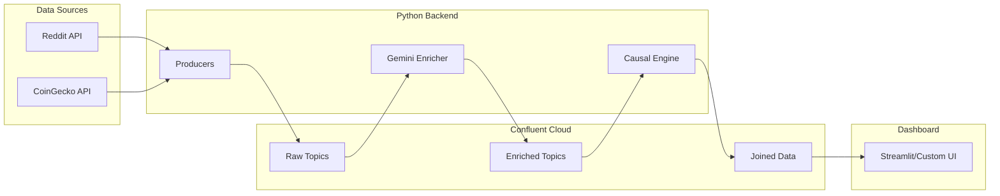

# CryptoSentinel MVP Implementation Plan

## Overview

Build a working MVP that demonstrates real-time causal inference between social sentiment and crypto prices. The system will:

1. Stream Reddit posts and crypto prices into Confluent Kafka
2. Enrich posts with Gemini sentiment analysis
3. Perform rolling Granger causality analysis
4. Display live results in a dashboard



---

## Phase 1: Project Setup and Credentials

### 1.1 Create Project Structure

```javascript
cryptosentinel/
├── README.md
├── requirements.txt
├── .env.example
├── .gitignore
├── config/
│   ├── __init__.py
│   └── settings.py          # Pydantic settings management
├── producers/
│   ├── __init__.py
│   ├── reddit_producer.py   # Stream Reddit posts to Kafka
│   └── price_producer.py    # Stream crypto prices to Kafka
├── consumers/
│   ├── __init__.py
│   └── enrichment_consumer.py  # Gemini sentiment enrichment
├── causal/
│   ├── __init__.py
│   └── granger.py           # Granger causality implementation
├── dashboard/
│   └── app.py               # Streamlit dashboard (or custom frontend)
└── schemas/
    ├── reddit_post.avsc
    └── crypto_price.avsc
```


### 1.2 Credential Setup Guide

**Confluent Cloud** (Free trial available):

1. Sign up at https://confluent.cloud
2. Create a Basic cluster (free tier works for MVP)
3. Create API keys for Kafka and Schema Registry
4. Note down bootstrap servers, API key/secret, Schema Registry URL

**Google Cloud / Gemini API**:

1. Go to https://aistudio.google.com/app/apikey
2. Create a Gemini API key (free tier: 15 RPM, 1M tokens/day)
3. For Vertex AI (optional for MVP): Create GCP project, enable Vertex AI API

**Reddit API**:

1. Go to https://www.reddit.com/prefs/apps
2. Create a "script" type application
3. Note client_id (under app name) and client_secret

**CoinGecko API**:

- Free tier works without API key (10-50 calls/min)
- Optional: Get free API key at https://www.coingecko.com/en/api

---

## Phase 2: Core Backend Implementation

### 2.1 Configuration Module (`config/settings.py`)

- Pydantic-based settings loading from environment variables
- Validation for all required credentials
- Kafka connection configuration

### 2.2 Reddit Producer (`producers/reddit_producer.py`)

- Use `praw` library to stream posts from crypto subreddits
- Serialize to Avro and publish to `social.reddit.raw` topic
- Handle rate limits gracefully

### 2.3 Price Producer (`producers/price_producer.py`)

- Poll CoinGecko API every 30-60 seconds
- Publish prices for BTC, ETH, SOL to `crypto.prices.raw` topic
- Include price, volume, and 24h change

### 2.4 Enrichment Consumer (`consumers/enrichment_consumer.py`)

- Consume from `social.reddit.raw`
- Call Gemini API to extract sentiment (score, label, mentioned coins)
- Publish enriched data to `social.reddit.enriched`

### 2.5 Causal Analysis Engine (`causal/granger.py`)

- Implement bidirectional Granger causality test
- Rolling window analysis (60-minute windows)
- Output: causal direction, lead-lag minutes, confidence

---

## Phase 3: Dashboard (Frontend)

### Option A: Streamlit (Recommended for MVP speed)

- Real-time price and sentiment displays
- Causal direction arrow visualization
- Live-updating charts with Plotly
- Gemini-generated natural language insights

### Option B: Custom Frontend

- If you specify React/Vue/etc., I'll create a FastAPI backend with WebSocket support
- Separate frontend with modern UI components

---

## Phase 4: Integration and Demo

### 4.1 Docker Compose Setup

- All services containerized
- Single `docker-compose up` to run everything

### 4.2 Demo Mode

- Fallback to simulated data if APIs fail
- Pre-seeded historical data for causality demo

---

## Key Files to Implement

| File | Purpose | Priority |

|------|---------|----------|

| `requirements.txt` | Dependencies | P0 |

| `config/settings.py` | Configuration management | P0 |

| `producers/reddit_producer.py` | Reddit data ingestion | P0 |

| `producers/price_producer.py` | Price data ingestion | P0 |

| `consumers/enrichment_consumer.py` | Gemini sentiment | P0 |

| `causal/granger.py` | Causal inference | P0 |

| `dashboard/app.py` | UI | P0 |

| `.env.example` | Credential template | P1 |

| `schemas/*.avsc` | Avro schemas | P1 |---

## Dependencies

```javascript
confluent-kafka>=2.3.0
google-generativeai>=0.3.0
praw>=7.7.0
requests>=2.31.0
pandas>=2.1.0
numpy>=1.26.0
statsmodels>=0.14.0
streamlit>=1.29.0
plotly>=5.18.0
python-dotenv>=1.0.0
pydantic>=2.5.0
pydantic-settings>=2.0.0
loguru>=0.7.0
fastavro>=1.9.0
```

---

## Next Steps

1. **Confirm frontend choice** - Streamlit or specify your preference
2. **I'll create the project structure and all core files**
3. **You'll add your credentials to `.env`**